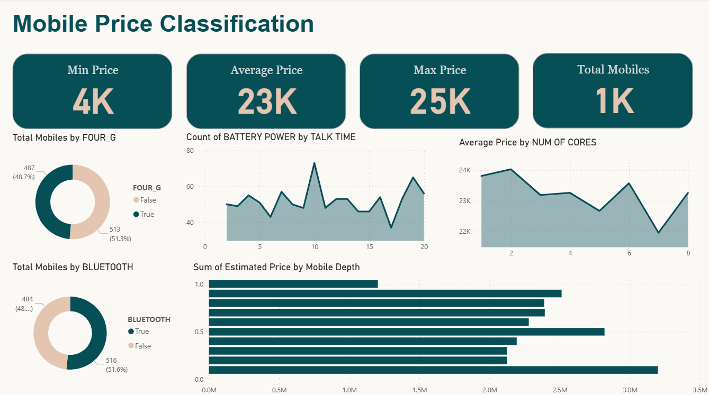
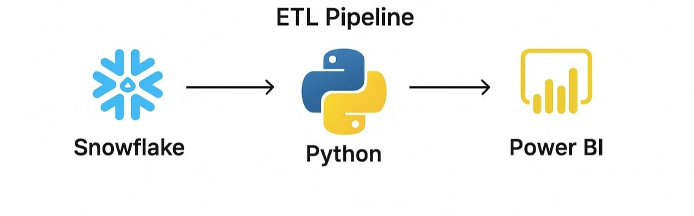

# 📊 Mobile Price Data Engineering Project  

## 🚀 Overview  
This project demonstrates a complete **ETL pipeline** built with **Snowflake**, **Python**, and **Power BI** to analyze mobile phone data.  
The goal is to extract, transform, and visualize key insights about mobile phone performance and pricing.

*Power BI Dashboard Overview*

---

## 🧩 Tools & Technologies  
- ❄️ **Snowflake** – Data storage and management  
- 🐍 **Python** – Data extraction, transformation, and loading (ETL)  
- 📈 **Power BI** – Data visualization and reporting  

---

## 🔄 ETL Pipeline  
1. **Extract:** Data pulled from Snowflake tables  
2. **Transform:** Python scripts used for cleaning and processing  
3. **Load:** Transformed data loaded into Power BI for visualization  

*ETL Pipeline Diagram*

---

## 📊 Power BI Dashboard  
The dashboard includes:
- **KPI Cards:** CPU speed, RAM, storage, and pricing insights  
- **Visuals:**  
  - Bar chart – Price vs Performance  
  - Line chart – RAM vs Price  
  - Treemap – Price categories by processor type  

---

## 🧠 Key Learnings  
- Building and automating ETL pipelines  
- Connecting Snowflake with Python and Power BI  
- Designing insightful data visualizations  

---

## 📬 Contact  
👤 **Ali Abdalla Ali**  
📧 [aliabdalla335533@gmail.com ]  
🔗 [LinkedIn Profile](www.linkedin.com/in/ali-abdalla-623b38383)  
